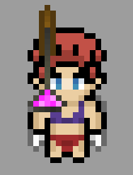

# Champions

### What is a Champion?

A Champion will be the focus of our NFT based game and can be entered into the Arena to potentially win a share of the pool reward.

### Attributes

* Legs
* Body
* Face
* Eyes
* Head
* Shoulders
* Hand

### Creation

There will be two tiers of Champions: Randomized and Full Set

1. Randomized - Champions created with a collage of universal assets which do not belong to a dedicated "set"
   1. 
2. Full Set - High rarity sets that are aesthetically complete, asset dependent
   1. .png>)

### Fields

* Base Power
* Num of wins
* Bounty earned

## \[REDACTED] Supply

### Initial mint supply of 8888

### Another 8888 can be minted using EXP using a disinflationary model
